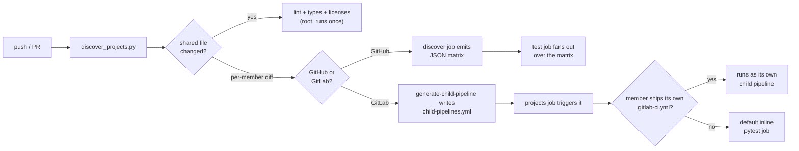

# python-workspace-template

A Cookiecutter / Cruft template for a **uv workspace monorepo** — one repository
hosting many Python projects that share a single `uv.lock` and one dev toolchain.

Pair it with [`python-workspace-member`](../python-workspace-member) to add projects.

## Use it

```bash
cruft create git@github.com:evansdoe/python-templates.git --directory python-workspace-template
cd my-workspace
uv sync --all-packages --all-groups     # creates uv.lock — commit it
```

## Layout

```
my-workspace/
├── pyproject.toml          # virtual root: members = ["projects/*"], shared dev groups
├── uv.lock                 # one lockfile for every member
├── ruff.toml               # shared lint config
├── scripts/ci/discover_projects.py
├── mkdocs.yml               # optional: root docs hub (include_docs)
└── projects/
    ├── geo-core/
    └── bench-cli/
```

## CI model

Lint, format, type checks and the license audit run **once** at the root over
every member. Tests run **per member**, and only for members the change touches.

The list of members is discovered at runtime by
`scripts/ci/discover_projects.py`, so **adding a project never requires editing a
pipeline file**:

- **GitHub Actions** — a `discover` job emits a JSON matrix; `test` fans out over it.
- **GitLab CI** — `generate-child-pipeline` writes `child-pipelines.yml`, which the
  `projects` job triggers. A member that ships its own `.gitlab-ci.yml` gets
  triggered as a child pipeline instead of the default test job.

Changes to `pyproject.toml`, `uv.lock`, `ruff.toml`, `scripts/` or the CI config
count as affecting every member.



Try the discovery locally:

```bash
uv run poe projects                                        # all members
python scripts/ci/discover_projects.py --format github --base main
python scripts/ci/discover_projects.py --format gitlab --base main
```

## Root shape: `root_kind`

|                       | `virtual` (default)                       | `application`                                                                         |
| --------------------- | ----------------------------------------- | ------------------------------------------------------------------------------------- |
| Repo ships            | several independently released projects   | one deliverable built from internal libraries                                         |
| Root `pyproject.toml` | no `[project]` table                      | a real package with `src/` and a console script                                       |
| Members are wired by  | the `members = ["projects/*"]` glob alone | the glob, **plus** `dependencies` + `[tool.uv.sources]` for each member the root uses |
| Adding a member       | nothing to edit                           | register it in the root if the root uses it                                           |

Membership never comes from a dependency edge: in both shapes `uv sync` installs
every member editable and the single `uv.lock` covers all of them. Declaring a
dependency only matters when one package *imports* another — root to member, or
member to member — and it always needs the `[tool.uv.sources]` half:

```toml
dependencies = ["geo-core"]

[tool.uv.sources]
geo-core = { workspace = true }
```

Without the sources entry uv looks for `geo-core` on PyPI and `uv lock` fails
with *"is included as a workspace member, but is missing an entry in
`tool.uv.sources`"*.

## Options

`license`, `python_version`, `min_python_version`, `uv_version` (`latest` or a
pin, e.g. `0.12.5`), `ci_platform` (github/gitlab/both), `type_checker`
(mypy/ty/none), `include_docs`, `include_precommit`, `include_devcontainer`,
`include_danger`.

## Docs (`include_docs`)

Ships a root `mkdocs.yml` + `docs/index.md` as a hub, not a per-member API
reference. `uv sync --all-packages --all-groups` installs every member
editable into the workspace's single `.venv`, so a member's modules are
already importable when `mkdocs serve` runs at the root — no per-member
`paths:` to keep in sync as members come and go. Document a member's public
API from the root with `::: module_name`; adding its page to `nav:` is still
a manual, editorial step.

## Danger.js rules (`include_danger`)

The rule logic lives in [`danger-rules`](https://github.com/evansdoe/danger-rules),
a small shared package pinned by tag in `scripts/danger/package.json` —
not a local file, and not inline in `dangerfile.ts`. It's shared with
`python-package-template` so a fix lands in one place instead of two
copies that can silently drift apart. `dangerfile.ts` itself is just:

```ts
import { runDanger } from "danger-rules";

runDanger({
  sourcePathMarker: "/src/",
  testsPathMarker: "/tests/",
  // maxCommitsPerAuthor: 5,
  // requireCommitSigning: true,
});
```

Built in, on by default: Conventional Commits PR/MR title, a minimum
description length, a changelog/tests reminder when any member's `src/`
changes, and a changed-lines-of-code size guard. Path checks use substring
markers, not a fixed prefix — the package defaults to `"src/"`/`"tests/"`
for a single top-level layout, and this template overrides both to
`/src/`/`/tests/` since "source changed" here means any member's
`projects/<name>/src/`, not one repo-wide `src/`. Two more checks are off
by default — pass them in `dangerfile.ts`'s config object to turn them on:

| Option                 | Default | Effect                                                                                     |
| ----------------------- | ------- | ------------------------------------------------------------------------------------------- |
| `maxCommitsPerAuthor`   | `0` (off) | Warns when one author has more than this many commits on the PR/MR                        |
| `requireCommitSigning`  | `false`   | GitHub: fails on any unsigned commit. GitLab: Danger's MR DSL can't see commit signatures, so this posts an informational message pointing at **Settings → Repository → Push Rules → Reject unsigned commits** instead |

Every other threshold (`minDescriptionLength`, `maxLinesChanged`,
`sourcePathMarker`, `testsPathMarker`, etc.) is also overridable the same
way, or set to `0`/`false` to disable that check entirely.

Linting for the danger scripts themselves runs through
[Biome](https://biomejs.dev) (`pnpm lint` / `pnpm format`), which both CI
platforms run before `danger ci --failOnErrors`.

See the [`danger-rules` README](https://github.com/evansdoe/danger-rules)
for why it imports Danger's types with `import type` instead of a value
import, and why it ships a compiled `dist/` rather than raw TypeScript.

## Note on type checking

The root mypy config excludes `projects/*/tests/`: members legitimately reuse
test file names (`tests/test_smoke.py` in each), which mypy cannot map to
distinct modules. Pytest handles them via `--import-mode=importlib`.
